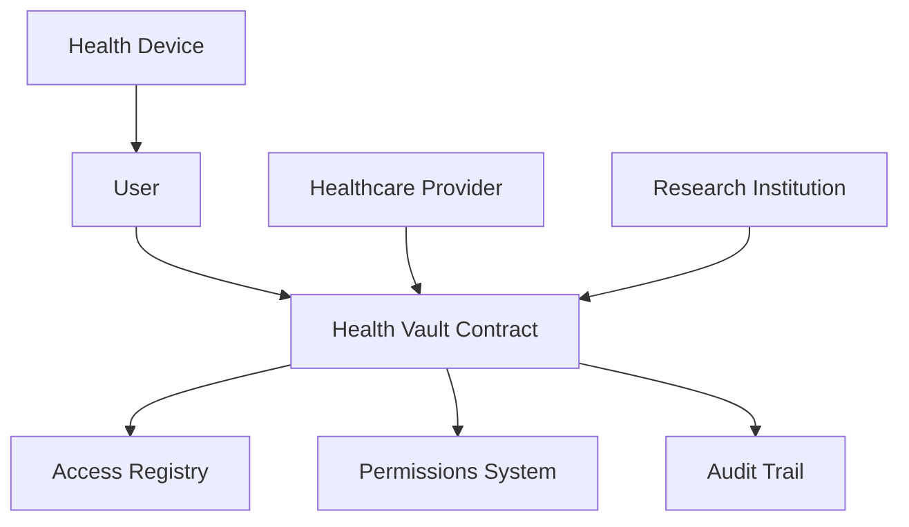

# Alpha Heap: Decentralized Health Data Management

## Overview

Alpha Heap is an innovative blockchain-powered platform for secure, user-controlled health data management from wearable devices and health monitoring systems.

### Core Mission

Create a decentralized ecosystem where individuals maintain sovereign control over their personal health data, enabling selective, transparent, and secure sharing with authorized entities.

### Key Features

- User-controlled data access permissions
- Secure device registration system
- Verified entity authentication
- Comprehensive access audit trail
- Support for multiple health data categories

## Architecture

The Alpha Heap system is built around a core smart contract that manages:
- User registration and authentication
- Device registration and management
- Granular access control and permissions
- Verified consumer management
- Immutable access history tracking



## Contract Documentation

### Health Vault Contract

The main contract (`health-vault.clar`) handles all core functionality for the Alpha Heap platform.

#### Supported Health Data Categories
- Cardio Rate
- Blood Pressure
- Rest Metrics
- Fitness Activity
- Metabolic Glucose
- Oxygen Saturation
- Body Temperature
- Body Weight

#### Key Components

1. **User Management**
   - Secure user onboarding
   - Device linking and management
   
2. **Access Control**
   - Granular permission mechanisms
   - Entity verification
   - Dynamic access granting/revocation

3. **Audit System**
   - Comprehensive access logging
   - Transparent access tracking

## Getting Started

### Prerequisites
- Clarinet
- Stacks wallet
- Access to Stacks blockchain

### Basic Usage

1. **User Onboarding**
```clarity
(contract-call? .health-vault onboard-user)
```

2. **Link Health Device**
```clarity
(contract-call? .health-vault link-user-device "device-123" "fitness-tracker")
```

3. **Authorize Data Access**
```clarity
(contract-call? .health-vault authorize-data-access 
    research-principal 
    "cardio-rate" 
    (some u100000))
```

## Function Reference

### Public Functions

#### User Management
```clarity
(define-public (onboard-user))
(define-public (link-user-device (device-id (string-ascii 64)) (device-type (string-ascii 64))))
(define-public (unlink-user-device (device-id (string-ascii 64))))
```

#### Access Control
```clarity
(define-public (authorize-data-access (consumer principal) (data-type (string-ascii 64)) (expiry (optional uint))))
(define-public (revoke-data-access (consumer principal) (data-type (string-ascii 64))))
```

### Read-Only Functions
```clarity
(define-read-only (query-user-registration (user principal)))
(define-read-only (query-entity-verification (consumer principal)))
(define-read-only (verify-data-access (user principal) (consumer principal) (data-type (string-ascii 64))))
(define-read-only (retrieve-access-details (access-id uint)))
```

## Development

### Testing
1. Clone the repository
2. Install Clarinet
3. Run test suite:
```bash
clarinet test
```

### Local Development
1. Start Clarinet console:
```bash
clarinet console
```
2. Deploy and interact with contracts

## Security Considerations

### Data Privacy
- No sensitive health data stored on-chain
- Access permissions and audit logs maintained securely
- Recommended: Encrypt off-chain data storage

### Access Control
- Strict entity verification
- Regular access log audits
- Time-bound access permissions
- Immediate revocation capabilities

### Best Practices
- Implement robust off-chain identity verification
- Periodic permission reviews
- Continuous access monitoring
- Preference for time-limited access grants

## Contributing

Contributions welcome! Please review our contribution guidelines.

## License

MIT License

## Built By

Alpha Heap Technologies - Empowering Personal Health Data Sovereignty